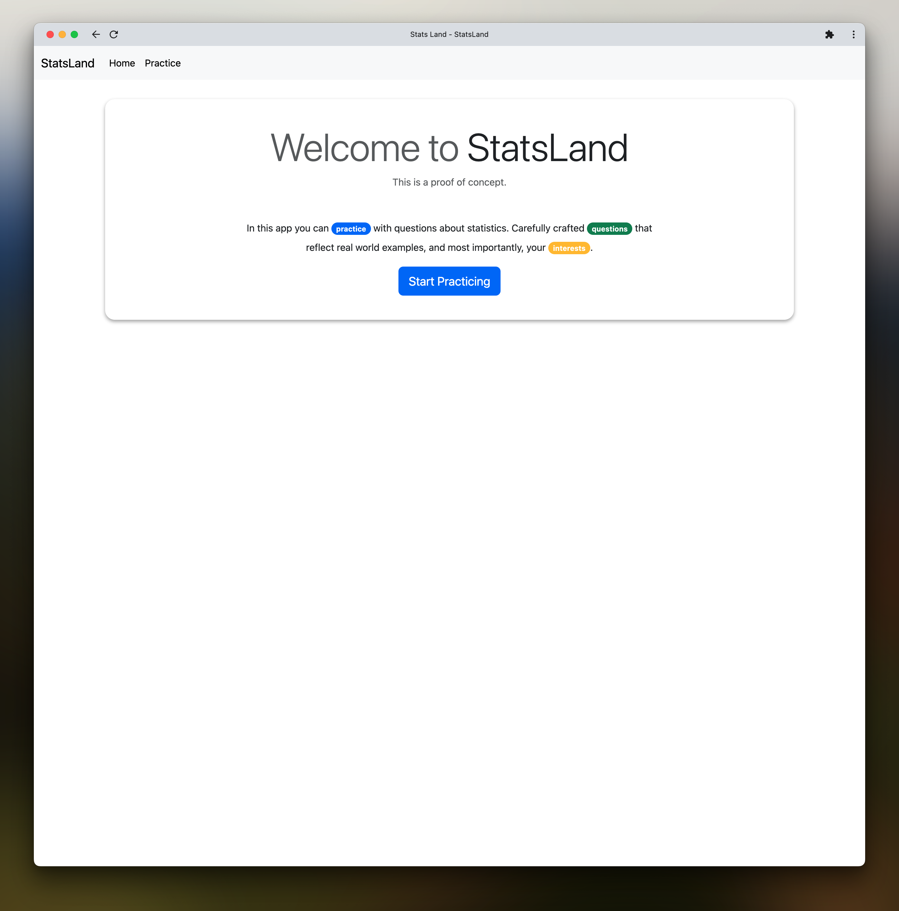
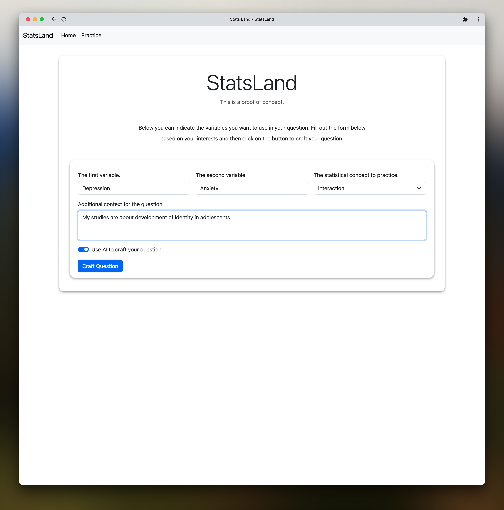
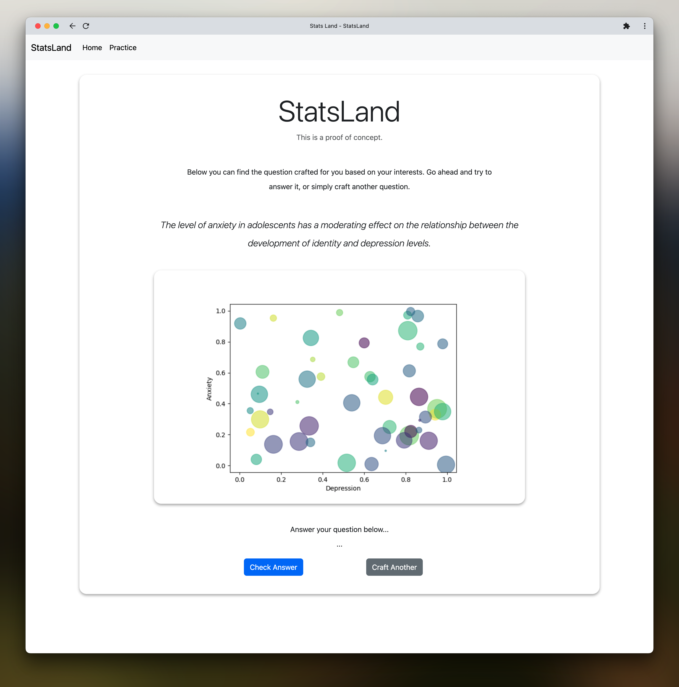

# StatsLand

Below you can find minimal information on how to run the proof of concept
`StatsLand` application.

## Installation

Create a virtual environment:

```bash
 python3 -m venv .venv
```

Activate the virtual environment (i.e., for `macOS` and `Linux`):

```bash
source .venv/bin/activate
```

Activate the virtual environment (i.e., for `Windows`):

```bash
.venv\Scripts\activate
```

Install the required packages:

```bash
pip3 install -r requirements.txt
```

## Usage

```bash
flask --app app run --debug
```

*Note.* Make sure the `OPENAI_API_KEY` environment variable is set.

## Screenshots

**Landing Page**




**Question Details**



**Question Result**


